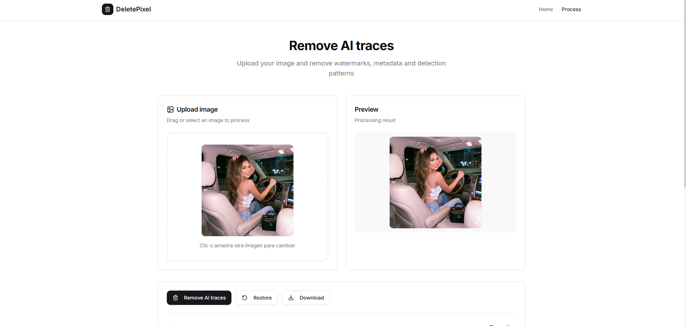

# DeletePixel - LSB Image Processor

<div align="center">


A modern web platform for image processing using LSB (Least Significant Bit) steganography. Modify the least significant bits of your images invisibly, keeping the visual appearance identical while completely changing the binary patterns.

[Features](#-features) • [Installation](#-installation) • [How It Works](#-how-it-works) • [Project Structure](#-project-structure)

</div>

## 📸 Screenshots

<div align="center">




</div>

---

## 🚀 Tech Stack

| Technology | Version | Description |
|------------|---------|-------------|
| **React** | 19.2.0 | UI Library |
| **TypeScript** | 5.9 | Static Typing |
| **Vite** | 7.2 | Build Tool & Dev Server |
| **React Router** | 7.9 | Client-side Routing |
| **Tailwind CSS** | 3.4 | Utility-first CSS Framework |
| **Radix UI** | Latest | Accessible UI Components |
| **Lucide React** | Latest | Icon Library |
| **Canvas API** | Native | Browser-based Image Processing |

## ✨ Features

- 🎨 **LSB Processing**: Modify least significant bits of RGB channels
- 🔄 **Reversible**: Restore original images using a unique seed
- 🖼️ **Drag & Drop**: Intuitive interface to drag and drop images
- 🔒 **Privacy First**: All processing happens in your browser, no servers involved
- ⚡ **Fast**: Instant image processing
- 🎭 **Modern Design**: Attractive animations and visual effects
- 📱 **Responsive**: Works on desktop and mobile devices

## 📦 Installation

```bash
# Clone the repository
git clone https://github.com/samukingx/Delete-SynthID-of-Gemini.git

# Navigate to project directory
cd Delete-SynthID-of-Gemini

# Install dependencies
npm install

# Start development server
npm run dev

# Build for production
npm run build

# Preview production build
npm run preview
```

## 📁 Project Structure

```
deletepixel/
├── public/                  # Static assets
├── src/
│   ├── assets/              # Images and static resources
│   ├── components/
│   │   ├── ui/              # Reusable UI components (shadcn/ui)
│   │   │   ├── badge.tsx
│   │   │   ├── button.tsx
│   │   │   ├── card.tsx
│   │   │   ├── input.tsx
│   │   │   ├── label.tsx
│   │   │   └── skeleton.tsx
│   │   ├── Layout.tsx       # Main layout with navigation
│   │   └── ImageDropZone.tsx # Drag & drop component
│   ├── hooks/
│   │   └── useAuth.ts       # Authentication hook
│   ├── lib/
│   │   └── utils.ts         # Utility functions (cn helper)
│   ├── pages/
│   │   ├── Home.tsx         # Landing page
│   │   └── ProcessImage.tsx # Main image processing page
│   ├── services/
│   │   └── api.ts           # API client
│   ├── types/
│   │   └── index.ts         # TypeScript definitions
│   ├── utils/
│   │   └── imageProcessor.ts # LSB logic and processing
│   ├── App.tsx              # Main component with routes
│   ├── main.tsx             # Entry point
│   └── index.css            # Global styles with animations
├── eslint.config.js         # ESLint configuration
├── tailwind.config.js       # Tailwind CSS configuration
├── postcss.config.js        # PostCSS configuration
├── tsconfig.json            # TypeScript configuration
├── vite.config.ts           # Vite configuration
└── package.json             # Project dependencies
```

## 🔬 How It Works

### LSB Steganography

The LSB (Least Significant Bit) algorithm modifies the least significant bits of each color channel (RGB) in the image:

1. **Processing**:
   - Takes each pixel from the image
   - Extracts the least significant bit (LSB) from each R, G, B channel
   - Applies XOR with bits from a key generated from the seed
   - Replaces the modified LSB

2. **Result**:
   - The image looks **identical** to the human eye
   - Binary patterns change completely
   - The change is visually invisible

3. **Reversibility**:
   - Using the same seed, the process is perfectly reversible
   - Applying the same algorithm restores the original image
   - Without the seed, restoration is impossible

### Usage

1. **Load Image**: Drag and drop an image or click to select
2. **Process**: Click "Process with LSB" to modify the bits
3. **Save Seed**: Copy or download the generated seed (essential!)
4. **Download**: Download the processed image
5. **Restore**: Use the seed to restore the original image

## 🛠️ Available Scripts

| Script | Description |
|--------|-------------|
| `npm run dev` | Start development server with hot reload |
| `npm run build` | Build for production (TypeScript + Vite) |
| `npm run lint` | Run ESLint for code quality |
| `npm run preview` | Preview production build locally |

## 🤝 Contributing

Contributions are welcome! Please feel free to submit a Pull Request.

1. Fork the repository
2. Create your feature branch (`git checkout -b feature/AmazingFeature`)
3. Commit your changes (`git commit -m 'Add some AmazingFeature'`)
4. Push to the branch (`git push origin feature/AmazingFeature`)
5. Open a Pull Request

## 📄 License

This project is licensed under the MIT License - see the [LICENSE](LICENSE) file for details.

---

<div align="center">

Made with ❤️ by [samukingx](https://github.com/samukingx)

</div>
